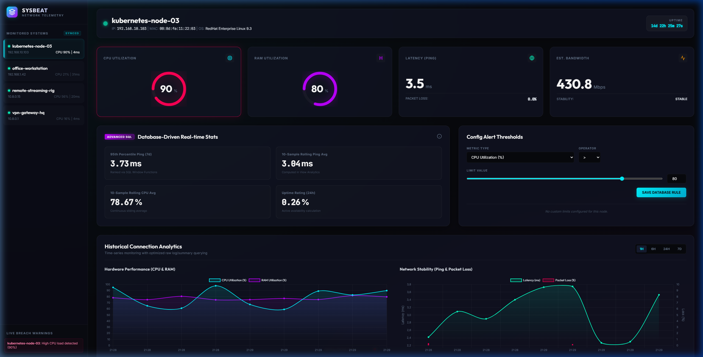

# SysBeat | Distributed Network Telemetry & Alerting System

**SysBeat** is a distributed real-time telemetry logging, metrics aggregation, and autonomous alerting system designed to monitor remote hosts, virtual environments, streaming setups, and VPN overlays (like Tailscale).

The project is engineered with high-concurrency database optimizations and responsive front-end visualizations, showcasing professional-grade relational data management.

---

## 🖥️ Live Showcase

### System Dashboard Overview
*Real-time glassmorphic dashboard showcasing live hardware and network stability telemetry across concurrent nodes:*

---

## 🚀 Key Features

*   **Real-time Glassmorphic Dashboard**: A dark-theme UI featuring glowing radial SVG gauges, continuous incident warning logs, and interactive range-bound performance timelines.
*   **High-concurrency SQLite WAL Engine**: Optimized with Write-Ahead Logging (`WAL` mode) and connection pooling to ensure zero thread-locks under simultaneous parallel daemon uploads.
*   **Autonomous DB Alert Triggers**: Database-layer SQL triggers (`trg_check_alerts`) that autonomously open incidents on limit breaches and auto-resolve them in real-time when metrics return to normal.
*   **O(1) Incremental Summaries**: SQL database triggers (`trg_aggregate_hourly`) that compute hourly log aggregations upon metrics insertion, eliminating high-cost periodic cron rollups.
*   **Statistical Windows Analytics**: Custom SQLite views and queries computing 10-period rolling averages and 7-day 95th percentile calculations entirely inside the relational engine.

---

## 🛠️ Getting Started

### 1. Install Dependencies
Make sure Python is installed, then install the required telemetry daemon and web server libraries:
```bash
pip install flask requests psutil
```

### 2. Start the SysBeat Backend Server
Launch the central Flask REST API, which automatically initializes the SQLite schema, registers the views, and installs the triggers:
```bash
python server.py
```
The server will boot and listen on port `5000` (`http://localhost:5000`).

### 3. Run the System Daemon or Simulator
*   **For physical system logs**: Launch the lightweight local metrics daemon on any target node:
    ```bash
    python daemon.py
    ```
*   **For simulated multi-node testing**: Run the simulator, which spawns 4 concurrent threads representing different servers (`vpn-gateway-hq`, `remote-streaming-rig`, etc.) uploading metrics every 3 seconds:
    ```bash
    python simulator.py
    ```

### 4. Monitor the System
Open your web browser and navigate to:
```
http://localhost:5000
```
Configure real-time limit threshold rules on the fly, observe the neon Chart.js time-series streams, and watch the incident tables auto-resolve breaches!

---

## 📂 Project Architecture

```
├── database.py       # SQLite WAL database initializer, views, and trigger compilation
├── server.py         # Thread-safe Flask REST API and query-planned endpoints
├── daemon.py         # Local hardware metrics collector and ping monitor
├── simulator.py      # Concurrent multi-threaded node performance simulator
├── .gitignore        # Standard git ignore definitions for compiled caches and DBs
├── README.md         # General system documentation and user guidelines
├── templates/
│   └── index.html    # Central HTML semantic layout structure
└── static/
    ├── css/
    │   └── styles.css # Custom dark space glassmorphic styles
    └── js/
        └── app.js     # Vanilla state controller, polling loops, and Chart.js streams
```
